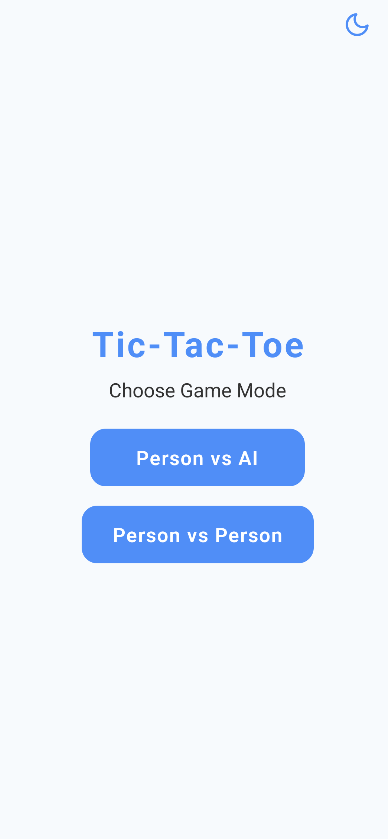
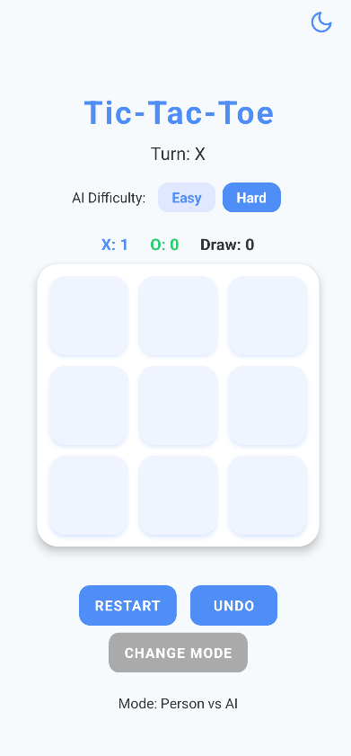
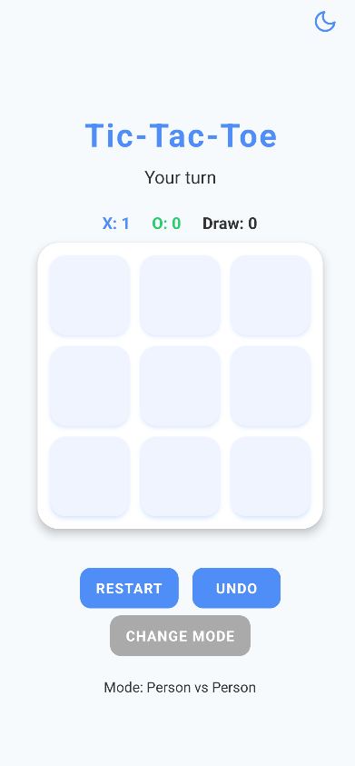
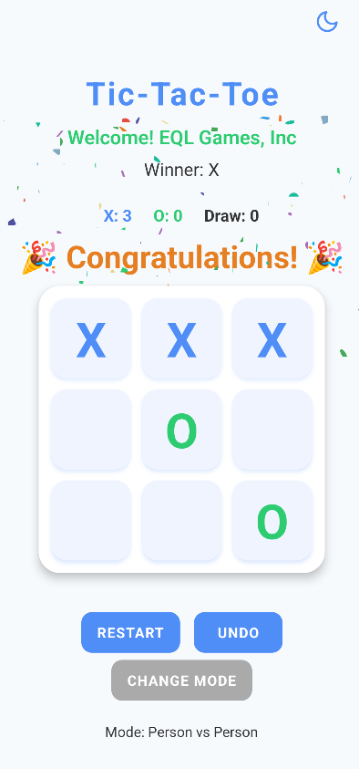
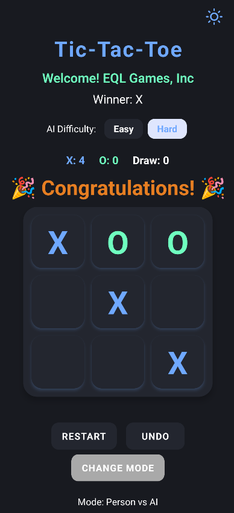

# 🎯 Tic-Tac-Toe AI - React Native Game

A sophisticated, feature-rich Tic-Tac-Toe game built with React Native and TypeScript, featuring intelligent AI opponents and an elegant user experience.







## ✨ Key Features

### 🎮 Game Modes
- **Single Player vs AI**: Challenge an intelligent opponent with configurable difficulty
- **Two Player (PvP)**: Play with friends on the same device
- **AI Difficulty Levels**: Choose between Easy (random) and Hard (unbeatable Minimax algorithm)

### 🎨 User Experience
- **Dynamic Theme System**: Seamlessly switch between light and dark modes
- **Responsive Design**: Optimized for all device sizes and orientations
- **Intuitive Controls**: Touch-friendly interface with smooth animations
- **Accessibility**: Screen reader support and inclusive design

### 🏆 Game Features
- **Move History**: Undo your last move at any time
- **Score Tracking**: Persistent scoreboard for all game modes
- **Celebration Effects**: Confetti animation and congratulations message on victory
- **Smart AI**: Advanced Minimax algorithm for challenging gameplay

## 🚀 Getting Started

### Prerequisites
- Node.js (v14 or higher)
- npm or yarn package manager
- Expo CLI (optional, can use npx)

### Installation

1. **Clone the repository**
   ```bash
   git clone https://github.com/lincocln816/expo-tic-tac-toe
   cd tic-tac-toe-ai
   ```

2. **Install dependencies**
   ```bash
   npm install
   ```

3. **Start the development server**
   ```bash
   npx expo start
   ```

### Running the App

#### On Physical Device
- Install the **Expo Go** app from your device's app store
- Scan the QR code displayed in the terminal or browser

#### On Emulator/Simulator
- **iOS Simulator**: Press `i` in the terminal (requires Xcode)
- **Android Emulator**: Press `a` in the terminal (requires Android Studio)

## 🎯 How to Play

### Game Setup
1. Launch the app and select your preferred game mode
2. For AI mode, choose your desired difficulty level
3. You'll always play as **X**, while the AI or second player is **O**

### Gameplay
- **Making Moves**: Tap any empty square to place your mark
- **Turn Management**: The game automatically alternates between players
- **Undo Feature**: Use the Undo button to reverse your last move
- **Restart**: Start a new game anytime with the Restart button

### Winning Conditions
- **Three in a Row**: Achieve three consecutive marks horizontally, vertically, or diagonally
- **Draw**: When all squares are filled without a winner
- **Celebration**: Enjoy confetti and congratulations when you win!

## 🎨 Customization

### Theme Switching
- **Light Mode**: Clean, bright interface for daytime use
- **Dark Mode**: Easy on the eyes for low-light environments
- **Quick Access**: Tap the sun/moon icon in the top-right corner

### Game Settings
- **Mode Selection**: Switch between AI and PvP modes anytime
- **Difficulty Adjustment**: Modify AI intelligence level during gameplay
- **Score Reset**: Clear your scoreboard when desired

## 🏗️ Technical Architecture

### Built With
- **React Native**: Cross-platform mobile development
- **TypeScript**: Type-safe code with enhanced developer experience
- **Expo**: Streamlined development and deployment workflow
- **Minimax Algorithm**: Advanced AI decision-making for challenging gameplay

### Project Structure
```
tic-tac-toe-ai/
├── App.tsx                 # Main application component
├── components/             # Reusable UI components
│   ├── Board.tsx          # Game board layout
│   ├── Square.tsx         # Individual game squares
│   └── AppButton.tsx      # Custom button component
├── utils/                  # Game logic and utilities
│   └── ai.ts              # AI algorithms and game rules
└── assets/                 # Images and static resources
```

## 🔧 Development

### Code Quality
- **TypeScript**: Full type safety and IntelliSense support
- **ESLint**: Code quality and consistency enforcement
- **Responsive Design**: Adaptive layouts for all screen sizes
- **Performance**: Optimized rendering and smooth animations

### Contributing
We welcome contributions! Please feel free to:
- Report bugs or suggest new features
- Submit pull requests for improvements
- Help improve documentation
- Share your gaming experience and feedback

## 📱 Platform Support

- **iOS**: 12.0 and above
- **Android**: 6.0 (API level 23) and above
- **Web**: Responsive web interface (coming soon)

## 🎉 What Makes This Special?

This Tic-Tac-Toe implementation goes beyond the basic game by offering:
- **Intelligent AI**: Challenge yourself against a truly unbeatable opponent
- **Modern UI/UX**: Beautiful, responsive design that adapts to your device
- **Accessibility**: Inclusive design for all users
- **Performance**: Smooth animations and responsive touch controls
- **Cross-Platform**: Consistent experience across iOS and Android

## 📞 Support & Feedback

We value your feedback! If you encounter any issues or have suggestions:
- **GitHub Issues**: Report bugs or request features
- **Discussions**: Share your thoughts and experiences
- **Email**: Contact us directly for support

---

**Built with ❤️ using React Native and TypeScript**

*Enjoy your gaming experience! 🎮*